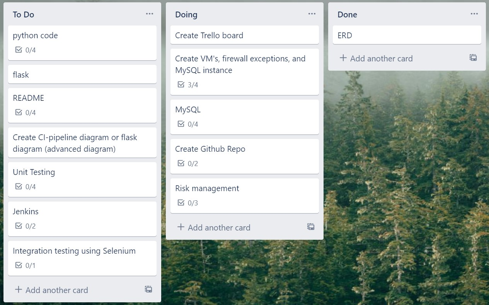
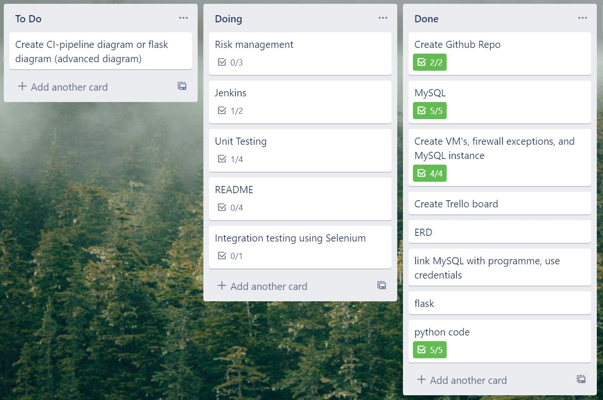
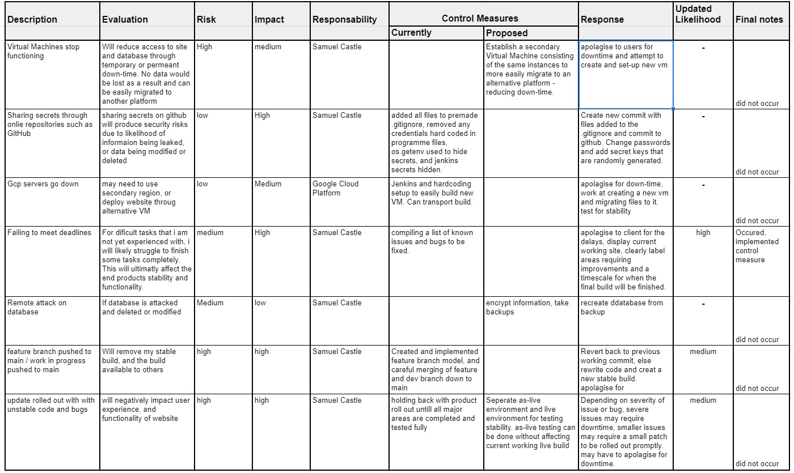
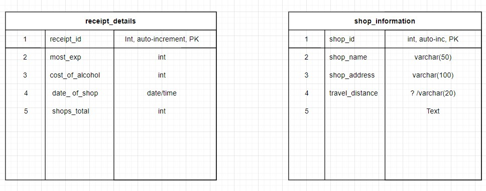
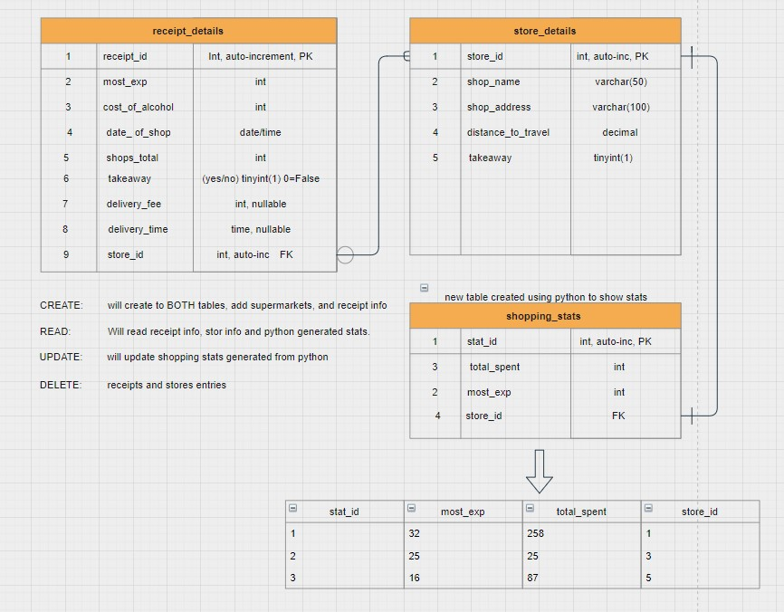

# fundamental-project-1

## Contents
* [Introduction](#introduction) 
* [Proposal](#proposal)
* [Trello](#trello)
* [Risk Assessment](#risk-assessment)
* [Entity Relationship Diagram](#entity-relationship-diagram)
* [Development](#development)
* [Front-End Design](#front-end)
* [Testing](#testing)
* [Unit Testing](#unit-testing)
* [Integration]
* [Bugs](#bugs)
* [Jenkins](#jenkins)

# Introduction
This project was to create two or more databases with a relationship, demonstrate good coding practice, and create a working website with emphasis on CRUD functionality.

# Proposal
To create the MVP within the specified time period, the idea specified to meet criteria is a receipt tracking webste with pages to create, add, update, and delete receipts. linking these receipts to stores in a seperate database. a final table could be produced to assimilate information from both tables - this goes above the intentions of the MVP and is considered secondary.

# Trello
I began the project by listing out all tasks that i believed would need to be completed to meet the MVP - information for this was taken from QA Community to reduce the likelihood of missing an key element.

My trello board was updated as the project developed, however it is still only a simple trello board. I have limited experience using trello and limited time. Trello functioned as to-do, doing, and done to clearly demonstrate the projects progress and was comprised of prodominatly crucial stages of operations.

# Risk Assessment
I created a Risk Assesment before beginning my project to highlight potential risks that i have identified. 

I continued added columns as the project progressed and i found a potential issue, including potential risks related to github secrets, as-live testing and any issues with the project that could cause delays.
Furthermoor risk was updated and whether or not an issue occured to-date.

# Entity Relationship Diagram
my entity relationship diagram went through a few iterations as i worked out their relationship and what the contents of each table would be.

my first ERD was basic, - few columns, incorrect information, lack of information and lacked relations

Develouped erds show more information on information types, column names, primary and foreign keys amonst other vital information.
I have chosen to create a simplified version of my project with two tables to meet the MVP before constructing my third table

# Development
The project began with building my tables in python and linking them with a db made in mysql. I created a VM using Google Cloud Provider and a Mysql Instance

