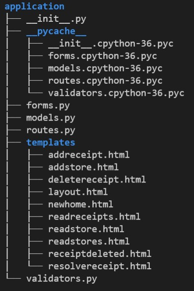

# fundamental-project-1

## Contents
* [Introduction](#introduction) 
* [Proposal](#proposal)
* [Trello](#trello)
* [Risk Assessment](#risk-assessment)
* [Entity Relationship Diagram](#entity-relationship-diagram)
* [Development](#development))
* [Testing](#testing)
* [Unit Testing](#unit-testing)
* [Integration]
* [Bugs](#bugs)
* [Jenkins](#jenkins)

# Introduction
This project was to create two or more databases with a relationship, demonstrate good coding practice, and create a working website with emphasis on CRUD functionality.

# Proposal
To create the MVP within the specified time period, the idea specified to meet criteria is a receipt tracking webste with pages to create, add, update, and delete receipts. linking these receipts to stores in a seperate database. a final table could be produced to assimilate information from both tables - this goes above the intentions of the MVP and is considered secondary.

# Trello
I began the project by listing out all tasks that i believed would need to be completed to meet the MVP - information for this was taken from QA Community to reduce the likelihood of missing an key element.

My trello board was updated as the project developed, however it is still only a simple trello board. I have limited experience using trello and limited time. Trello functioned as to-do, doing, and done to clearly demonstrate the projects progress and was comprised of prodominatly crucial stages of operations.

# Risk Assessment
I created a Risk Assesment before beginning my project to highlight potential risks that i have identified. 

I continued added columns as the project progressed and i found a potential issue, including potential risks related to github secrets, as-live testing and any issues with the project that could cause delays.
Furthermoor risk was updated and whether or not an issue occured to-date.

# Entity Relationship Diagram
my entity relationship diagram went through a few iterations as i worked out their relationship and what the contents of each table would be.

my first ERD was basic, - few columns, incorrect information, lack of information and lacked relations

Develouped erds show more information on information types, column names, primary and foreign keys amonst other vital information.
I have chosen to create a simplified version of my project with two tables to meet the MVP before constructing my third table

# Development
The project began with building my tables in python and linking them with a db made in mysql. I created a VM and a MySQL Instance using Google Cloud Provider, Created my db in MySQL, added firewall exceptions, and added permissions for VM to access database. 

## Virtual Machine, GCP, File format
Secondly was downloading and installing necessary software to create and run my app effectively, then creating my file structure with application, app.py, create.py, __init__.py and others necessary for the project to function efficiently and maintain a good level of organisation.

## Gitignore
Added gitignore and added confidential files such as venv, credentials and pycache to prevent spilling secrets to github.

## Creating and populating tables 
Following the successfull creation and implementation of my VM and its software i created my tables in python and linked my app to my db in MySQL.
After creating my tables i edited my create.py to populate the table with some example information to be used with testing and demonstrations.

## Forms and HTML
Created my forms to gather the information needed through a basic html webpage, with submit buttons and boxes to input information.

## Routes
Created routes for: - Home page
                    - Add Receipt
                    - Read Receipt
                    - Edit Receipt
                    - Delete Receipt

I focused on CRUD functionality for one aspect of my web page - Tracking and keeping receipts. this was to save time and meet the MVP. These routes fufil there purpose with text to appear upon a successful action on Add or Delete.

after CRUD was completed for Receipts i added more routes for Store:
                    - Add Store
                    - Read Stores

- Added basic error messages to my routes to help with inputing relevant information

This is the structure of the current working version - with more pages to be added in a later iteration.

## Frontend
A web layout was created in HTML along with other pages needed to be rendered, and stored in templates to be called by routes. 
Layout was further develouped to be more user freindly including a navigation system for easily moving between pages with standard information.

## linking Routes and database with frontend
Finalised routes with information and added return_render templates.
At this point i was testing the functions of routes:
  - Displaying information
  - Displaying correct information
  - Navigating pages 
  - CRUD functionality on all current HTML pages works as intended.

# Testing
Created a test_app.py to test functionality of routes and created validaors (to be implemented).
Tests cover: 
  - Building database and tables
  - Populating tables
  - Testing Read for all available pages
  - Testing Add for Add Store & Add Receipt

requires further testing before deployment including
 - Update and Delete tests working
 - Selenium used for integration testing
 - Port testing

 

